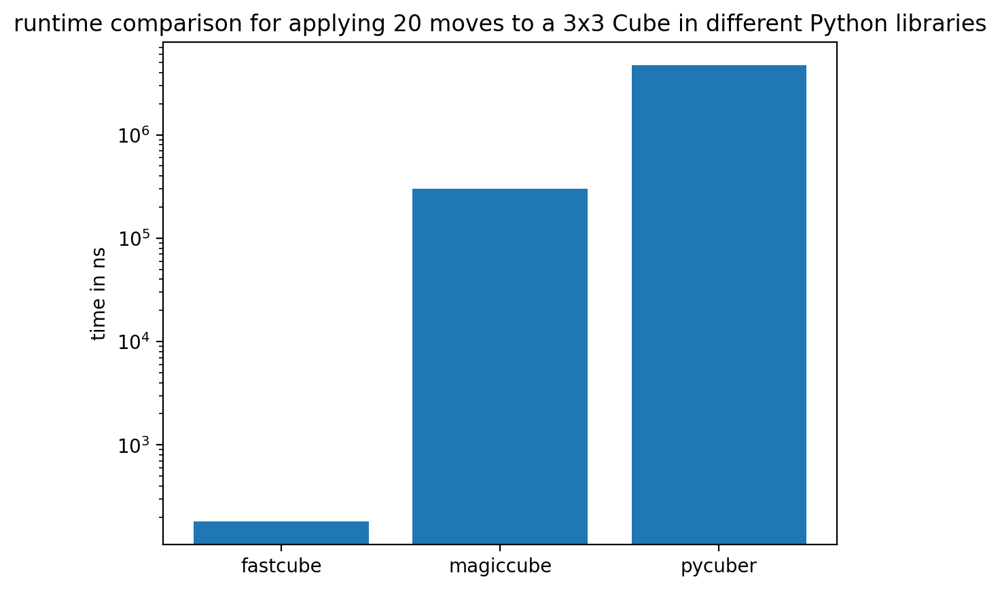

# rapidcube

rapidcube is a high-performance Rubik's Cube simulator for Python, implemented in Rust with PyO3.

It is designed for fast state transitions, algorithm simulation, and experimentation workflows such as search, benchmarking, and machine learning.

## Features

- Rust-backed speed with a Python-friendly API
- 2x2 and 3x3 cube models
- Fast face-turn methods for each basic move and inverse move
- Move-sequence parser via standard cube notation
- Compact integer state encoding for efficient state handling
- ANSI-colored text rendering for quick terminal inspection



## Installation

### From Source (development)

Requirements:

- Python 3.13 recommended (package metadata currently targets 3.8+)
- Rust toolchain (stable)
- [uv](https://docs.astral.sh/uv/) (recommended) or maturin

```bash
git clone git@github.com:oblo0810/rapidcube.git
cd rapidcube

# Using uv (recommended)
uv sync
uv run maturin develop --release

# Or using standard pip
python -m pip install maturin
maturin develop --release
```

## Quick Start

### 2x2 Example

```python
from rapidcube import Cube2x2

cube = Cube2x2()
print(cube)

cube.do_moves("R U R' U'")

print(cube)
print("Binary encoding:", cube.to_binary())
```

### 3x3 Example

```python
from rapidcube import Cube3x3

cube = Cube3x3()
cube.do_moves("F R U R' U' F'")

print("Corners encoding:", cube.to_binary())
print(cube)
```

## Move Notation

The move parser supports whitespace-separated tokens:

- Face turns: `U D R L F B`
- Inverse turns: append `'` or `!` (example: `R'`, `U!`)
- Double turns: append `2` (example: `F2`)

Example:

```text
R U R' U' F2 D B'
```

Note: unknown tokens are ignored by `do_moves`.

## API Overview

### Cube2x2

- `Cube2x2()`
- `state: int` (read-only)
- Single-move methods:
	- `do_u_move`, `do_u_prime_move`
	- `do_d_move`, `do_d_prime_move`
	- `do_r_move`, `do_r_prime_move`
	- `do_l_move`, `do_l_prime_move`
	- `do_f_move`, `do_f_prime_move`
	- `do_b_move`, `do_b_prime_move`
- `do_moves(moves: str)`
- `to_binary() -> str` (64-bit binary string)
- `str(cube)` returns an ANSI-colored net

### Cube3x3

- `Cube3x3()`
- `corners: int` (read-only)
- Same move methods as `Cube2x2`
- `do_moves(moves: str)`
- `to_binary() -> str` (corner-state binary encoding)
- `str(cube)` returns an ANSI-colored net

## Benchmarks

Benchmark tests are included under `benchmarks/` and compare selected operations against other Python cube libraries.

Run benchmarks with:

```bash
uv run pytest benchmarks/ -k benchmark --benchmark-sort=mean
```

## Testing

Run unit tests with:

```bash
uv run pytest -q
```

## Project Status

The project is currently in early development. The public API may evolve as testing and feature coverage expand.

## License

Add a `LICENSE` file before publishing publicly on GitHub and PyPI.
A common choice for Rust/Python libraries is MIT or Apache-2.0.
